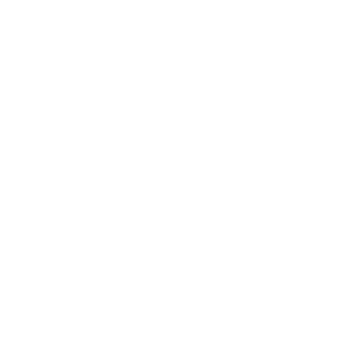

# squares

<h2 align="center">Venco's branding kit!</h2>

## Original logo vector files

Filled                                                           | Outlined                                                  |
:--------------------------------------------------------------: | :-------------------------------------------------------: |
 |  |

Both of those were made with 3 Squares and an Exclude mask: 2 In the middle (1 Big 1 Smaller) and 1 in the corner; the one in the corner might be misaligned but it's on purpose

## Figma File
I did all my experimentations to come to this version in this file, and everything related to my branding will be there.

Some of the variants will only be on Figma to avoid clutter on this repo.

https://www.figma.com/design/d5ijx9QtxO7BH6GyXpCeVB/Vencos-design?node-id=25-206&t=vaEZ4vfwMluXGmF6-0

## Variants and related

Variant                               | Description
:-----------------------------------: | :-------------------------------------------------------:
 | [`venco_base.png`](./venco_base.png)   The original logo variant; used outline color from https://v3nco.dev/ for the logo
 | [`venco_mono.png`](./venco_mono.png)   The original logo variant but monochrome
  | [`faviconv1.png`](./faviconv1.png)   First version of the favicon for https://v3nco.dev; i don't really like it, i wanna change it later

I have had some inspirations from [Emma's Circles](https://github.com/prplwtf/circles); go check [Emma's profile](https://github.com/prplwtf) out ! Really cool person.

<a property="dct:title" rel="cc:attributionURL" href="https://github.com/v3nco/squares">Venco's Squares</a> by <a rel="cc:attributionURL dct:creator" property="cc:attributionName" href="https://v3nco.dev">Venco (v3nco.dev)</a> is licensed under <a href="https://creativecommons.org/licenses/by-nc-sa/4.0/?ref=chooser-v1" target="_blank" rel="license noopener noreferrer" style="display:inline-block;">Creative Commons Attribution-NonCommercial-ShareAlike 4.0 International</a>

